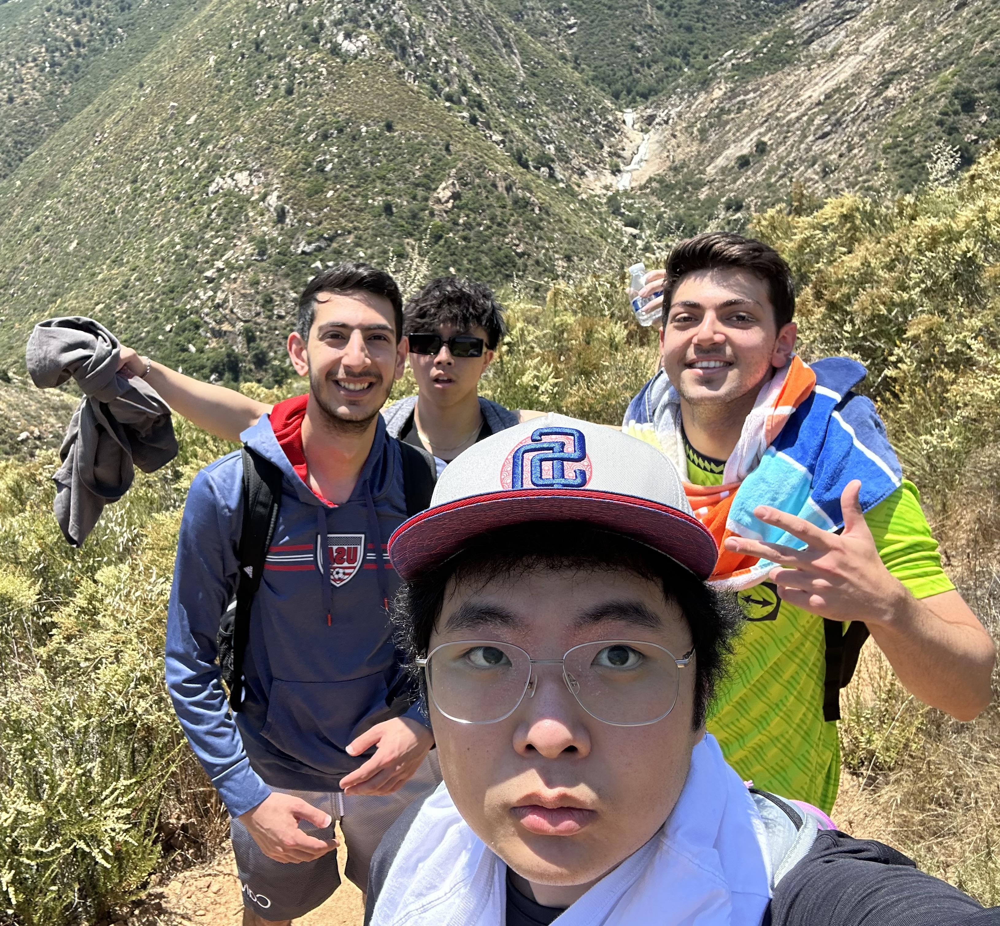

# CSE 110 
- [CSE 110](#cse-110)
  - [About me](#about-me)
  - [Hobbies](#hobbies)
  - [Task list](#task-list)

## About me 

My name is Ali Mohammadiasl and I am a third year CS student. I transferred from SD Miramar College fall of 2023. I love being active and going on hikes with friends. Here is an image of me and my friends at <a href="https://www.google.com/maps/place/Three+Sisters+Falls+Trail,+California/@32.981081,-116.6867752,17z/data=!3m1!4b1!4m6!3m5!1s0x80dbd943c79f4b8f:0x798c1d34afac987f!8m2!3d32.9810765!4d-116.6842003!16s%2Fg%2F1hc75pnd8?entry=ttu">Three Sister Falls trail</a>. I am the one with a towel around my neck (the towel was used to protect my head from the millions of flies that **attacked** us throughout the hike).


 <br>


My favorite programming language has to be either C++ or Python. I really like the simplicity of Python and how easy it is to use for something like Machine Learning. I also really like C++ because of its great syntax and how fast it is. Below you can find a very simple example of a deep neural network with 4 hidden layers as well as the optimizer and the trainer. This code was written using the `pandas`, `numpy`, and `sklearn` libraries. 

``` python
model = Sequential()
model.add(Input(shape=(X_train.shape[1],)))
model.add(Dense(12, activation='sigmoid'))
model.add(Dense(12, activation='sigmoid'))
model.add(Dense(12, activation='sigmoid'))
model.add(Dense(12, activation='sigmoid'))
model.add(Dense(numClasses, activation='softmax'))

optimizer = SGD(learning_rate=0.3)
model.compile(optimizer=optimizer, loss='mse', metrics=['accuracy'])

training = model.fit(X_train, y_train, validation_data=(X_test,y_test), epochs=100, batch_size=10)
```


## Hobbies

I am an avid soccer enjoyer. My favorite team is <a href="https://www.manutd.com/"> Manchester United</a>. Although they, for lack of a better word, **suck**, I grew up watching them and have unfortunately been a fan for as long as I can remember. <br>

My three all time favorite players (not in any specific order) are:

- <a href="https://www.manutd.com/en/players-and-staff/detail/wayne-rooney">Wayne Rooney</a>
- <a href="https://www.manutd.com/en/players-and-staff/detail/cristiano-ronaldo">Cristiano Ronaldo</a>
- <a href="https://www.manutd.com/en/players-and-staff/detail/de-gea">David DeGea</a>

> Once a red, always a red   

I also really enjoy going to the gym. I am quite a nerd when it comes to bodybuilding and powerlifting as I try to optimize my workouts as much as I can by choosing the best workouts and the optimal number of sets. I learned most of knowledge from [Jeff Nippard](imgs/JeffN.jpg). <br>

Here are my top three favorite exercises:

1. Seated dumbbell bicep curls
2. Incline dumbbell/machine chest press
3. Quad extensions


> Yeah buddy - Ronnie Coleman

## Task list

Here are some goals I have that I hope to accomplish before the end of the quarter.

- [ ]  Learn PyTorch
- [ ]  Deadlift 405 lbs
- [ ]  Mile 8:00
